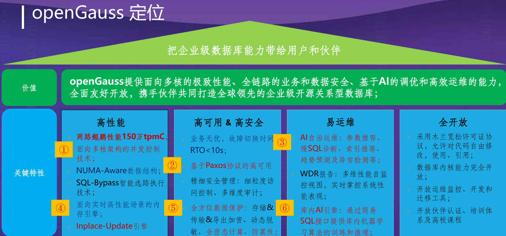
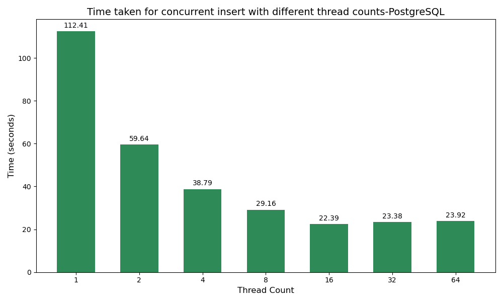
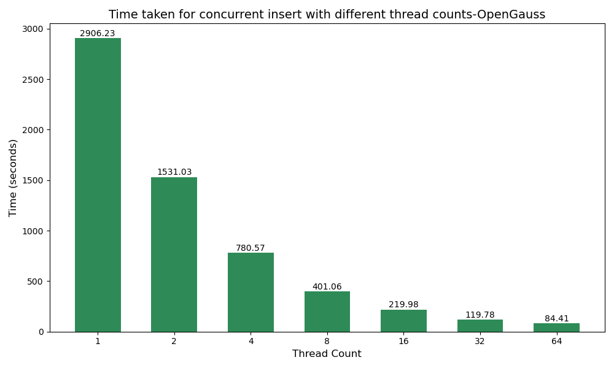
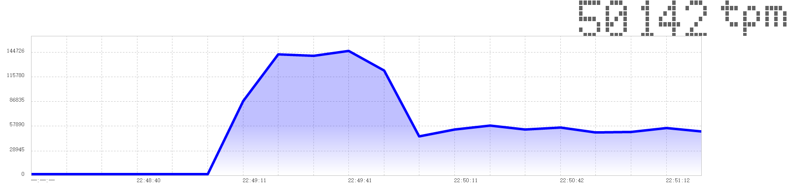
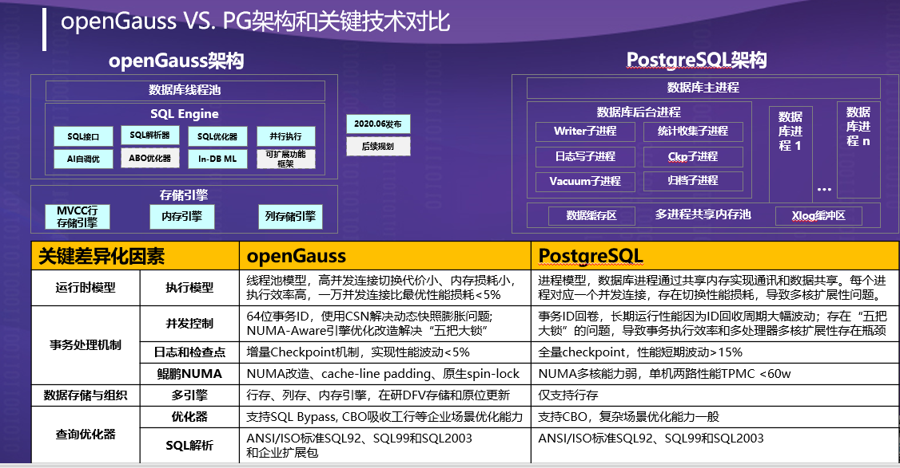
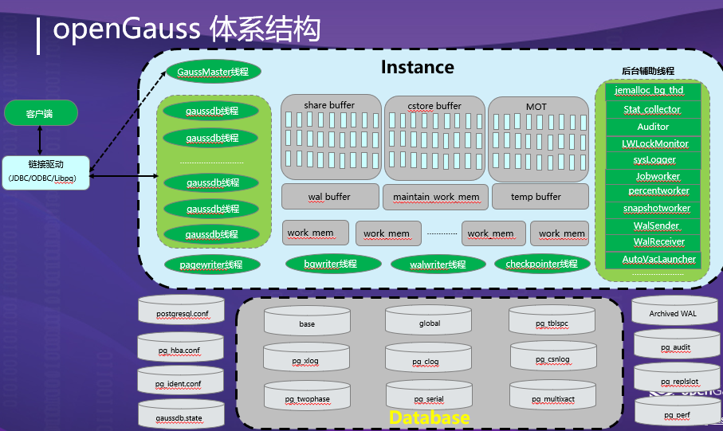
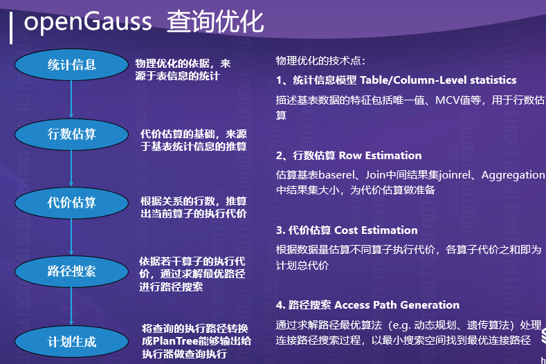
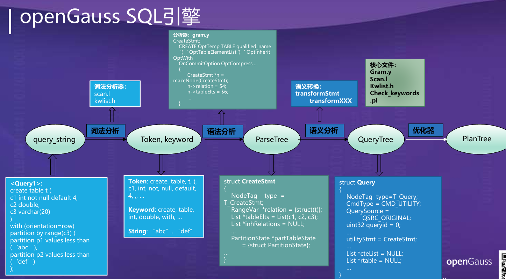
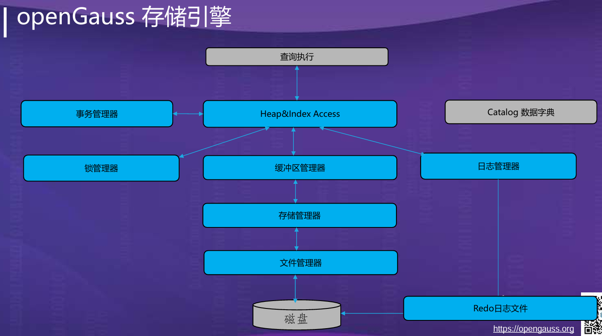

# CS213-Project3 OpenGauss对标PostgreSQL的比较分析

12310302 王子旭

# 零、项目说明

	为方便实现项目结果复现及查看等，本项目所有使用代码以及代码运行输出日志都在本人github仓库中保存，本文档中省略大部分代码以及输出结果，仅体现平均结果。

Github web URL: [https://github.com/wzxawa/DatabaseProject3.git](https://github.com/wzxawa/DatabaseProject3.git)

# 一、项目目的

* 评估和对比 openGauss 和 PostgreSQL 数据库的**性能表现**。
* 分析 openGauss 的**优势和劣势**，并评估其是否如其声称的那样优秀。
* 为决策者提供关于选择数据库系统的**参考依据。**

# 二、背景信息

## 1.PostgreSql概述

	在postgresql的官网（https://www.postgresql.org）中，开发者们这么介绍到自己产品的优势：

> PostgreSQL has earned a strong reputation for its proven architecture, reliability, data integrity, robust feature set, extensibility, and the dedication of the open source community behind the software to consistently deliver performant and innovative solutions. PostgreSQL runs on [all major operating systems](https://www.postgresql.org/download/), has been [ACID](https://en.wikipedia.org/wiki/ACID)-compliant since 2001, and has powerful add-ons such as the popular [PostGIS](https://postgis.net/) geospatial database extender. It is no surprise that PostgreSQL has become the open source relational database of choice for many people and organisations.

> PostgreSQL comes with [many features](https://www.postgresql.org/about/featurematrix/) aimed to help developers build applications, administrators to protect data integrity and build fault-tolerant environments, and help you manage your data no matter how big or small the dataset. In addition to being [free and open source](https://www.postgresql.org/about/license/), PostgreSQL is highly extensible. For example, you can define your own data types, build out custom functions, even write code from [different programming languages](https://www.postgresql.org/docs/current/xplang.html) without recompiling your database!

在其中主要介绍了它的优势为：

	1.完全**开源**并且拥有活跃的社区人员

	2.具有丰富多样的功能：

		**高级数据类型**: 支持多种数据类型，包括数组、JSON、XML、地理空间数据等

		**复杂的查询能力**: 支持多种查询功能，例如窗口函数、CTE、公共表表达式等。

		**索引优化**: 支持多种索引类型，例如 B 树索引、哈希索引、Gin 索引等，优化查询性能。

		**事务处理**: 支持 ACID 事务，确保数据的一致性和完整性。

	3.具有优秀的**并发性**以及**性能**

	4.具有优秀的**可靠性**和**灾难回复机制**

	5.具有优秀的**安全性**，具有强大的门禁系统、采用证书和其他方法进行多重身份验证

	6.具有良好的**扩展性**，如：可以扩展使用Java，Javascript（V8），R，Lua和Rust等多种语言

## 2.OpenGuass概述

在OpenGuass的官方介绍文档中（docs.opengauss.org）是这么介绍的：

> * **openGauss数据库具有高性能、高可用、高安全、易运维、全开放的特点。**
>
>   * 高性能
>
>     * 提供了面向多核架构的并发控制技术，结合鲲鹏硬件优化方案，在两路鲲鹏下，TPCC Benchmark可以达到150万tpmc的性能。
>     * 针对当前硬件多核numa的架构趋势， 在内核关键结构上采用了Numa-Aware的数据结构。
>     * 提供Sql-bypass智能快速引擎技术。
>     * 针对数据频繁更新的场景，提供ustore存储引擎。
>   * 高可用
>
>     * 支持主备同步、异步以及级联备机多种部署模式。
>     * 数据页CRC校验，损坏数据页通过备机自动修复。
>     * 备机并行恢复，10秒内可升主提供服务。
>     * 提供基于paxos分布式一致性协议的日志复制及选主框架。
>   * 高安全  
>     支持全密态计算，访问控制、加密认证、数据库审计、动态数据脱敏等安全特性，提供全方位端到端的数据安全保护。
>   * 易运维
>
>     * 基于AI的智能参数调优和索引推荐，提供AI自动参数推荐。
>     * 慢SQL诊断，多维性能自监控视图，实时掌控系统的性能表现。
>     * 提供在线自学习的SQL时间预测。
>   * 全开放
>
>     * 采用木兰宽松许可证协议，允许对代码自由修改，使用，引用。
>     * 数据库内核能力全开放。
>     * 提供丰富的伙伴认证，培训体系和高校课程。

​​

## 3.总结

	基于Postgre和Opengauss的介绍，我了解到它们都是关系型数据库，都认为自己具有不错的**性能**以及**高安全性、高可靠性（灾难恢复机制）** 等等，因此，我决定从以下几个方面来探究他们之间的差异。

# 三、数据库性能评估指标

1. 插入性能对比
2. 查询性能对比
3. 更新性能对比
4. 索引性能对比
5. 存储性能对比
6. 扩展性性能对比
7. HammerDB基准测试

# 四、测试环境搭建

## 1.本机电脑配置

我的笔记本电脑的设备规格如下：

	处理器	AMD Ryzen 7 4800H with Radeon Graphics            2.90 GHz  
	机带 RAM	16.0 GB (15.4 GB 可用)  
	系统类型	64 位操作系统, 基于 x64 的处理器

## 2.数据库配置

我采用了以下脚本来查看我的数据库配置：

```sql
--SHOW.sql
--数据库内存相关参数
SHOW shared_buffers;
SHOW work_mem;
SHOW maintenance_work_mem;
SHOW effective_cache_size;
--网络和连接相关参数
SHOW listen_addresses;
SHOW port;
SHOW max_connections;
```

### 数据库内存相关参数

1. ​`shared_buffers`​:

    * **描述**: 这个参数定义了 PostgreSQL 用于缓存数据的最小共享内存量。它是数据库缓存中最重要的一部分，用于缓存磁盘上的数据文件。
    * **性能影响**: 增加这个值可以提高数据库的性能，因为它减少了磁盘 I/O 操作。但是，设置过大可能会导致系统内存不足，影响其他应用程序的性能。
2. ​`work_mem`​:

    * **描述**: 这是单个数据库操作（如排序、哈希表、合并连接）可以使用的最大内存量。
    * **性能影响**: 提高这个值可以加快排序和复杂查询的速度，因为它减少了对临时磁盘文件的使用。但是，如果设置过高，可能会导致系统内存不足，尤其是当有大量并发操作时。
3. ​`maintenance_work_mem`​:

    * **描述**: 这个参数设置了维护操作（如 VACUUM、CREATE INDEX、ALTER TABLE ADD FOREIGN KEY）可以使用的最大内存量。
    * **性能影响**: 增加这个值可以加快维护操作的速度，因为这些操作通常需要大量的内存来处理。但是，由于这些操作不是持续进行的，所以通常不需要设置得像 `work_mem`​ 那么大。
4. ​`effective_cache_size`​:

    * **描述**: 这个参数是 PostgreSQL 用来估计可用于磁盘缓存的有效系统内存量的，包括操作系统缓存和 PostgreSQL 的共享缓冲区。
    * **性能影响**: 正确设置这个值可以帮助查询优化器做出更好的决策，比如选择合适的索引。设置得太低可能会导致优化器选择次优的查询计划。

### 网络和连接相关参数

5. ​`listen_addresses`​:

    * **描述**: 这个参数指定了 PostgreSQL 服务器监听客户端连接的 IP 地址。默认值通常是 ‘localhost’，意味着只允许本地连接。
6. ​`port`​:

    * **描述**: 这个参数指定了 PostgreSQL 服务器监听的端口号。
7. ​`max_connections`​:

    * **描述**: 这个参数设置了数据库可以接受的最大并发连接数。
    * **性能影响**: 增加这个值可以允许更多的并发用户连接，但过多的连接可能会导致系统资源紧张，从而降低性能。

我使用**docker-desktop安装了OpenGauss和PostgreSQL**，并且分别在PostgreSQL和OpenGauss中查询，我得到了以下结果：

|数据库|PostgreSQL|OpenGauss|
| :--------------------: | :----------------------------: | :------------------------------: |
|版本|docker image PostgreSQL 17.2|docker image [enmotech/opengauss:3.0.0](app://dd/dashboard/images/local/details?imageId=sha256%3A630bef775ee04fafba3b14d47bcbfc6cc13197bb3460c1145eee8bb77b6e044a&nameHint=enmotech%2Fopengauss%3A3.0.0&nameHintType=image-identity) PostgreSQL 9.2.4|
|shared_buffers|128MB|32MB|
|work_mem|4MB|64MB|
|maintenance_word_mem|64MB|16MB|
|effective_cache_size|4GB|128MB|
|max_connections|100|200|
|listen_addresses|*|*|
|port|5432|5432|

	查询得到两者以上的配置信息并不完全相同，**但都配置在docker container中，拥有相同的运行以及计算资源配置**，考虑到为开发者对于数据库默认配置的最佳组合，并没有修改其postgresql.conf配置内容。

	两者postgresql.conf配置在configure文件夹下有所保存。

# 五、测试方案

> **说明：所有测试代码以及结果输出日志都在git中保存，文档中不重复展现，所有展现结果皆为测试平均结果。**

## 1.插入性能对比

为了对比两个数据库的插入性能，我采用了三种将数据插入的方式，向表格中插入了300,000条数据

|测试方式|优势场景|性能影响的主要因素|指标意义|
| :--------: | :------------------------------------: | :---------------------------------: | :--------------------------------------: |
|单条插入|实时处理，逐条写入用户数据|事务提交、日志写入开销|单条插入耗时评估实时写入的效率|
|批量插入|数据迁移、大批量数据初始化|数据量、批量优化策略、索引、约束|每批数据的写入效率，优化批量导入的速度|
|并发插入|高并发写入（如电商订单、传感器数据）|锁竞争、连接池配置、线程/进程调度|并发写入的吞吐量，评估数据库的扩展能力|

平均时间结果：

|测试方式|PostgreSQL|OpenGauss|
| :-----------------: | :---------------: | :---------------: |
|single_insert|108.726 seconds|2941.11 seconds|
|batch_insert|2.81 seconds|18.71 seconds|
|concurrent insert|26.088 seconds|281.02 seconds|

	<u>**从结果来看，PostgreSQL的插入IO性能远远强于OpenGauss，OpenGauss的插入时间为PostgreSQL的10-30倍，尤其是在单条插入的情况下。**</u> 

## 2.查询性能对比

为了对比两个数据的查询性能，我采用了三种查询方式：

|**查询类型**|**测试方式**|**优势场景**|**性能影响的主要因素**|
| :----------------: | :---------------------------: | :----------------------------: | :-----------------------------------: |
|简单 SELECT 查询|聚合、排序、过滤|数据分析、快速查询小范围数据|数据量、索引、缓存策略|
|复杂 JOIN 查询|两表或多表联查、嵌套子查询|数据关联分析、多表数据整合|JOIN 类型、索引支持、优化器查询计划|
|分页查询|按 OFFSET 和 LIMIT 分页提取|数据展示、大表数据分段处理|OFFSET 大小、索引、排序策略|

测试结果如下：

|测试方式|PostgreSQL|OpenGauss|
| :----------: | :------------------: | :------------------: |
|简单select|0.01780 seconds|0.0299 seconds|
|复杂join|​​0.4906 seconds|0.7875 seconds|
|分页查询|0.0010 seconds|​​0.0141 seconds|

	**<u>由此可见：PostgreSQL在没有索引的条件下进行相同的查询，查询性能还是优于OpenGauss，但并不如插入性能对比明显。</u>** 

## 3.更新性能对比

|测试方式|操作|
| ----------------| ---------------------------------------------------------------------------------------------------------|
|批量更新测试|更新`users`​表中所有年龄小于50的用户的`city`​字段为’UpdatedCity’，进行计时并且回滚（确保数据库状态不变）|
|带条件更新测试|更新`users`​表中ID在1000到2000之间的用户的`city`​字段为’ConditionCity’。，进行及时并且回滚（确保数据库状态不变）|

### 测试意义：

* **批量更新**：模拟对于大量记录进行相同的更改，可以评估数据库处理大量数据更新的能力。
* **带条件更新**：模拟对满足特定条件的记录进行更改，反映了数据库处理复杂查询的能力，可以评估数据库处理特定数据集更新的能力。

平均测试结果如下：

|测试方式|PostgreSQL|OpenGauss|
| :--------------: | :----------------------------: | :----------------------------: |
|批量更新测试<br />|0.32718353271484374 seconds|0.4098818302154541 seconds|
|带条件更新测试|0.011602354049682618 seconds|0.014975976943969727 seconds|

	**<u>由此可见：PostgreSQL的性能在相同的更新操作下还是略微优于OpenGauss，但是也不如插入性能对比明显。</u>** 

## 4.索引性能对比

|测试方式|操作|测试意义|
| :--------: | :-----------------------------------------------------------------: | :----------------------------------------------: |
|索引创建|在`test_table`​表的`value`​字段上创建一个名为`idx_value`​的索引并记录时间|反映数据库处理索引创建这类资源密集型操作的能力|
|索引查询|执行一个查询，选择`test_table`​表中`value`​字段值小于或等于500的所有记录并记录时间|反映索引对查询效率的影响|

测试结果如下：

|测试方式|PostgreSQL|OpenGauss|
| :--------: | :------------: | :------------: |
|索引创建|​`1.6263368129730225`​ seconds|​`10.770158529281616`​ seconds|
|索引查询|​`0.00819849967956543`​ seconds|​`0.012386322021484375`​ seconds|

	**<u>由此可见：在建立索引并且通过索引查询的情况下，PostgreSQL的性能远远优于OpenGauss，运行时间大约为10倍，在索引的建立前，PostgreSQL的查询优势并不明显，但是在索引建立后，PostgreSQL展现出远远优于OpenGauss的查询优势。</u>** 

## 5.存储性能对比

|对比方面|操作|
| :----------------------------------: | :-------------------------------------------------------------------------------------------------: |
|表的总空间占用|pg\_size\_pretty(pg\_total\_relation\_size('{table\_name}')) AS total\_size,|
|表数据的实际存储空间（不包括索引）|pg\_size\_pretty(pg\_relation\_size('{table\_name}')) AS table\_size,|
|索引的空间占用|pg_size_pretty(pg_indexes_size('{table_name}')) AS index_size;|
|索引的存储效率|pg\_size\_pretty(pg\_relation\_size(indexrelid)) AS index\_size|

通过查询表的空间占用以及索引的空间占用等等，我们可以评估哪个数据库在存储资源使用上更高效。

测试结果如下：

|测试方面\空间占用|PostgreSQL|OpenGauss|
| :-----------------: | :----------: | :---------: |
|​`total_size`​|​`306 MB`​|​`259 MB`​|
|​`table_size`​|​`192 MB`​|​`140 MB`​|
|​`index_size`​|​`114 MB`​|​`120 MB`​|
|​`test_table_pkey`​|​`82 MB`​|​`60 MB`​|
|​`idx_value`​|​`32 MB`​|​`60 MB`​|

	**<u>由此可见：在拥有相同的index和数据库数据的情况下，OpenGauss在表数据和索引数据的占用对比PostgreSQL，使用了更少的物理内存，拥有更好的存储效率。</u>** 

## 6.扩展性对比

为了对比两个数据库的扩展性，我采用不同的线程数插入总量一定的数据（300,000条数据）测试，得到了如下结果：

​​

​​​

	**<u>可见，在线程数增加的时候，PostgreSQL的插入时间较为缓慢地减少，在更多线程的时候甚至出现了时间略微增加的现象；而OpenGauss的插入时间快速降低，并且并未到达上限，由此可以认为OpenGauss具有更好的并发扩展性，当我们使用更多的计算资源：多核和多线程的时候，OpenGauss的运行时间能够快速地降低。</u>** 

## 7.基准测试-Hammerdb

由于hammerdb只支持postgresql不支持opengauss，opengauss无法进行基准测试（pgbench也同样不支持）

#### PostgreSQL TPROC-C 基准测试结果：

​​

	在图中可以看出，PostgreSQl在测试初期迅速上升达到峰值，并且保持相对稳定，说明在这段时间，数据库已经满负载运行，资源（如 CPU、内存或磁盘 I/O）达到最佳利用状态；从22:49:41，TPS逐渐下降，可能表明数据库的某些资源（例如缓存、连接数）耗尽或达到瓶颈，或者是出现了锁竞争等性能瓶颈。在最后，TPS稳定在平稳水平，为50,000tpm左右，此数据可用于与其他数据库进行性能基准测试对比。

# 六、测试结果分析

## OpenGauss对比PostgreSQL：

### 1.优势：

#### 1.1 **高并发性能**

从测试结果中可以看出，OpenGauss 在多线程并发插入任务下展现了较强的性能，尤其是在 1 至 8 线程的区间，性能提升非常明显。由此可见：OpenGauss 相较于PostgreSQL更加专注于 OLTP（在线事务处理）场景，特别适用于并发处理。

**可能的底层原因**：

* **多核 CPU 支持**：OpenGauss 设计上优化了并发访问，能够高效地利用多核处理器资源。对于多核 CPU，OpenGauss 使用多进程和多线程技术优化了查询处理和事务管理。
* **高效的内存管理和数据缓存机制**：OpenGauss 在内存管理方面进行了多层次优化，使用了 **共享内存池** 和 **高速缓存**，这减少了 I/O 操作的频率，提高了数据访问速度。

在Opengauss的documentation中也有介绍：

> OpenGauss’s focus on scalability and performance is achieved through its efficient use of **multi-core CPU support**, **advanced memory management**, and **concurrency control** mechanisms that minimize resource contention during high transaction loads (Source: [OpenGauss Official Documentation](https://docs.opengauss.org/)).

​​

​​

**openGauss最显著的优势便在于其线程池以及高性能的并发控制，或许能够在鲲鹏NUMA上获得更好的效果，在处理大量数据上，使用并发控制能够拥有比PostgreSQL显著更好的性能。** 

#### 1.2 **自适应查询优化**

OpenGauss 支持 **自适应查询优化**，能够根据不同的查询负载自动调整执行计划。在高并发场景下，它能够根据查询的特点自动选择最佳的索引或并行执行策略，从而提高查询性能。

**可能的底层原因**：

* **自适应查询执行**：OpenGauss 可以根据实际的查询执行情况动态调整执行计划。对于复杂的查询和大量数据插入操作，能够优化执行计划，减少冗余的 I/O 操作和计算，提升系统的并发处理能力。

​​

**在进行一系列估算以及路径搜索后，openGauss能够悬崖边则最优的连接路径，从而使用最小的搜索空间，因此拥有更好的查询性能，但是在本实验中体现并不明显。**

​​

**在执行本实验的SQL命令时，openGauss会进行详细的语法以及语义分析，一遍找到最优的查询方案以及运行方案等。** 

#### 1.3 内存管理优势

Opengauss可能具有更加高效的 **内存管理系统** ，尤其在高并发和大数据量场景下，它的内存使用效率明显高于PostgreSQL。

**可能的底层原因：**

* **内存池（Memory Pool）** ：OpenGauss 采用了 **内存池管理**，通过将多个内存块统一管理，提高了内存分配和回收的效率。数据库查询和事务的过程中，不需要频繁的内存分配和回收，从而减少了内存碎片化，提高了内存使用的效率。
* **内存共享机制**：OpenGauss 的内存池能够在多个进程和线程之间共享内存资源，特别是在处理高并发请求时，可以有效减少内存的冗余使用，减少物理内存的占用。共享内存池机制使得多个线程和进程能够复用内存，从而提高了资源利用率。
* **内存的自适应管理**：OpenGauss 能够根据系统负载自动调整内存分配策略，减少不必要的内存开销。例如，系统负载较低时，内存使用可以更加精简，而在高负载时，它会动态调整内存使用量，以保证性能和稳定性。

​​

## 2.劣势

#### 2.1 在对于大量数据的插入，查询，更新的情况下性能较劣，可能在于**存储 I/O 限制**

高并发情况下，磁盘 I/O 的瓶颈可能还是Opengauss的性能瓶颈。OpenGauss 虽然在内存管理方面做了优化，但在面对大量数据插入时，磁盘的写入速度和吞吐量会成为限制因素。

**底层原因**：

* **磁盘 I/O**：在高并发的写入操作下，磁盘的读写速度往往无法满足数据的需求，特别是在没有使用高速 SSD 或分布式存储的情况下，磁盘 I/O 成为性能的瓶颈。

参考文献：

> As high transaction rates increase, the database may face **I/O bottlenecks**, especially when large amounts of data need to be written to disk. Using SSDs or distributing I/O across multiple nodes can alleviate these issues (Source: [PostgreSQL Performance Tuning](https://wiki.postgresql.org/wiki/Performance_Optimization)).

# 七、总结

### 1. **选择 OpenGauss 的情况**

#### 1.1 **需要大规模 OLTP 性能时**

* OpenGauss 对 OLTP（在线事务处理）场景进行了深度优化，适合需要快速、高并发事务处理的场景，如银行、电商、大型企业系统等。
* 在 **高并发、大量小事务** 的情况下，OpenGauss 展现了较强的性能优势。测试结果表明，OpenGauss 在中低并发场景下可以高效利用多核 CPU，处理大量并发请求。

#### 1.2 **需要高可扩展性的场景**

* 如果你需要支持高并发的大规模数据处理，尤其是在数据量不断增长的环境中，OpenGauss 提供了更好的扩展性。它支持分布式架构，可以根据需求横向扩展系统以适应更多的并发请求和更大的数据集。
* **分布式部署**：OpenGauss 支持分布式部署，能够横向扩展，满足大规模数据集和高并发的需求，尤其适用于对性能要求严格、数据量巨大的应用。

#### 1.3 **需要自适应查询优化和智能性能调优**

* OpenGauss 内置 **自适应查询优化** 和 **智能调度**，能够根据不同的查询负载自动选择最佳的查询执行计划。这使得它在面对复杂查询和大数据量时，能够自动优化查询执行，减少了性能调优的人工干预。
* 如果你没有足够的资源和时间来进行人工调优，OpenGauss 可以自动做出性能优化决策。

#### 1.4 **企业级支持和安全性要求**

* OpenGauss 作为一个由华为主导的数据库产品，针对企业级用户提供了商业级的支持、性能调优、安全性以及高可用性。对于需要长期支持和企业级服务的用户，OpenGauss 是一个不错的选择。
* **企业级安全性**：OpenGauss 提供了更强的 **数据加密**、**权限管理** 和 **审计功能**，适用于安全性要求高的企业应用。

#### 1.5 **专注于中国市场**

* 如果我们的数据库应用对象主要面向中国市场，OpenGauss 的生态和支持可能更符合本土需求。它在国内的云平台、硬件和服务中得到了更多的集成和优化。

### 2. **选择 PostgreSQL 的情况**

#### 2.1 **开源，成本较低**

* PostgreSQL 是完全开源的，适用于预算较为紧张的项目。如果你没有购买商业支持的预算，或者不需要额外的企业级支持，可以选择 PostgreSQL。
* PostgreSQL 作为开源数据库，拥有庞大的社区支持。社区提供了大量的文档、教程和第三方工具，可以帮助解决大多数问题。

#### 2.2 **应用中等规模的事务负载**

* PostgreSQL 非常适合中小型企业和中等规模的 OLTP 负载。在数据量不特别庞大、并发量适中的情况下，PostgreSQL 的性能和稳定性是足够的。
* 对于 **中小规模数据集** 和 **中等并发** 的 OLTP 应用，PostgreSQL 已经具备足够的处理能力，且无需专门的硬件支持。

#### 2.3 **丰富的扩展性和灵活性**

* PostgreSQL 提供了丰富的扩展性，支持自定义数据类型、函数、索引方法等，适用于开发定制化应用的场景。如果你的应用需要高度定制的功能，PostgreSQL 提供了更高的灵活性。
* PostgreSQL 有丰富的扩展插件和工具，如 **PostGIS**（地理空间数据扩展）、**pg_partman**（分区管理）、**Citus**（分布式扩展）等，可以根据需要灵活扩展。

#### 2.4 **需要更丰富的社区支持和生态**

* PostgreSQL 拥有一个活跃的社区，几乎可以解决所有数据库管理和调优相关的问题。开源社区的贡献使 PostgreSQL 的功能逐步完善，特别是在 **跨平台支持** 和 **兼容性** 上。
* 如果你更倾向于社区驱动的生态、文档和支持，PostgreSQL 无疑是一个非常好的选择。

#### 2.5 **多平台兼容**

* PostgreSQL 可以运行在几乎所有的操作系统上，包括 Linux、Windows 和 macOS。这使得 PostgreSQL 在不同平台上具有很好的兼容性，适用于开发跨平台应用。

#### 2.6 **低延迟和快速响应的分析查询（OLAP）**

* 虽然 PostgreSQL 主要是 OLTP 数据库，但通过一些扩展（如 `Citus`​、`TimescaleDB`​ 等），它也可以处理大规模的 **OLAP**（在线分析处理）任务。如果你的工作负载中包含大量的数据分析查询，PostgreSQL 可以通过扩展获得类似于专用分析数据库的能力。

### 3. **结合实际情况做出决策**

* <u>如果需要在 </u>​**<u>高并发</u>**​<u> 和 </u>​**<u>大规模数据</u>**​<u> 场景中处理事务，且需要</u>​<u>**企业级支持**</u>​<u>，</u>​**<u>OpenGauss</u>**​<u> 可能更适合。</u>
* <u>如果项目预算有限，需要 </u>​**<u>开源</u>**​<u> 和 </u>​**<u>灵活性</u>**​<u>，或者</u>​**<u>应用规模相对较小</u>**​<u>，</u>​**<u>PostgreSQL</u>**​<u> 将会是一个非常合适的选择。</u>

同时，由于本人能力有限，无法对于数据库的更多底层逻辑进行深入探讨，可以结合本Project实际测试结果以及OpenGauss技术人员撰写的**技术架构介绍文档**来做出决定。

文档如下：[openGauss 技术架构.pdf](assets/openGauss%20技术架构-20241222153817-uy1tb6l.pdf)
